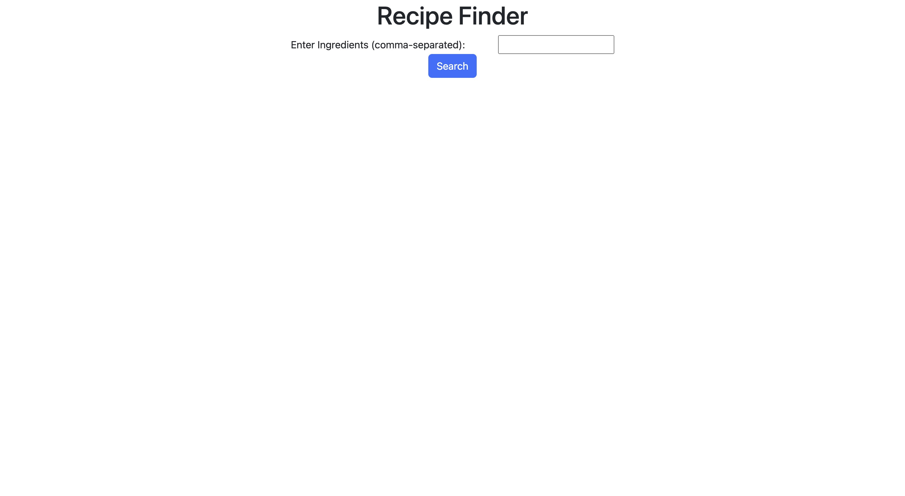
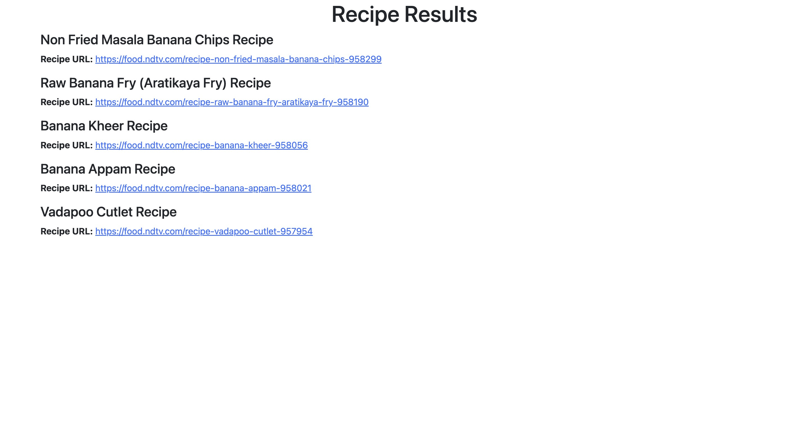

# Recipe Finder Website

## Overview

The **Recipe Finder Website** is a Python-based web application that allows users to discover recipes based on the ingredients they have available. This website is designed to make meal planning and cooking easier by providing a convenient way to find recipes that match the ingredients at hand.




## Features

- **Ingredient Search:** Users can input a list of ingredients they have, and the website will search for recipes that include those ingredients.

- **Recipe Details:** Users can view detailed information about each recipe, including its name, ingredients, cooking instructions, and an image.

## Usage

1. **Search for Recipes:** Enter the ingredients you have in the search bar and click "Search." The website will display a list of recipes that match your ingredients.

2. **View Recipe Details:** Click on a recipe to view its details, including the name, ingredients, cooking instructions, and an image.

## Installation

1. Clone this repository to your local machine:

   ```bash
   git clone https://github.com/your-username/recipe-finder-website.git
   ```

2. Set up the necessary Python environment and dependencies. This may include installing packages such as Flask, BeautifulSoup, and requests.

3. Run the Flask application:

   ```bash
   python app.py
   ```

   The website should now be accessible at `http://localhost:5000`.

## Technologies Used

- Python: The programming language used for developing the web scraping logic and backend of the website.

- Flask: A web framework for Python used to build the web application.

- BeautifulSoup: A library for web scraping in Python, used to extract recipe information from websites.

## Contributing

Contributions are welcome! If you'd like to contribute to the development of this project, please follow these steps:

1. Fork the repository.

2. Create a new branch for your feature or bug fix:

   ```bash
   git checkout -b feature/your-feature-name
   ```

3. Make your changes and commit them:

   ```bash
   git commit -m "Add your commit message here"
   ```

4. Push your changes to your forked repository:

   ```bash
   git push origin feature/your-feature-name
   ```

5. Create a pull request to the main repository, explaining your changes and the problem they solve.
